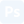

# Hi, I'm Victor 👋
>I'm a Frontend-focused Fullstack Developer with a keen eye for design. 
>I turn ideas into interactive experiences. 
>I build fast, responsive, accessible and aesthetically refined websites & webapps. 

## 🚀 About me
- 📍 I am based in the city of Copenhagen, Denmark.
- ✨ I find joy in being creative and building visually stunning websites & webapps that not only catch the eye, but also captivate the user, enhancing the overall web experience.
- 💡 My toolbox boasts `React`, `Tailwind CSS`, and `TypeScript` as my current favorites. I am eager to constantly refine my skills and learn more technologies.

## Tech I Work With
### 🖥 Frontend

### ⚙ Backend

### 🗄 Databases

### 🎨 Design & Prototype

### 🚀 Dev & Tools

## Find me on

